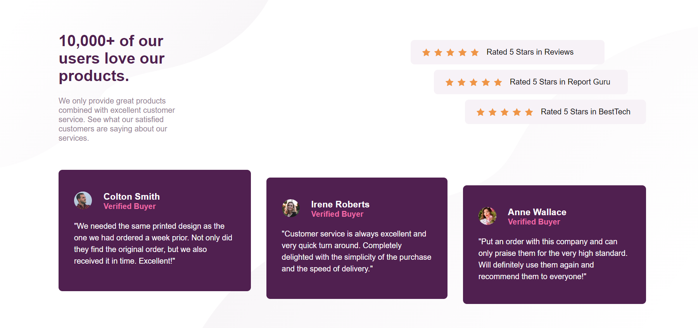
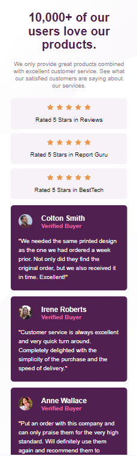

# Frontend Mentor - Social proof section solution

This is a solution to the [Social proof section challenge on Frontend Mentor](https://www.frontendmentor.io/challenges/social-proof-section-6e0qTv_bA). Frontend Mentor challenges help you improve your coding skills by building realistic projects. 

## Table of contents

- [Overview](#overview)
  - [The challenge](#the-challenge)
  - [Screenshot](#screenshot)
  - [Links](#links)
- [My process](#my-process)
  - [Built with](#built-with)
  - [What I learned](#what-i-learned)
  - [Continued development](#continued-development)
- [Author](#author)
- [Acknowledgments](#acknowledgments)

## Overview
I have extensively used `flexbox` to implement this layout. 

### The challenge

Users should be able to:

- View the optimal layout for the section depending on their device's screen size

### Screenshot
#### Desktop design.

#### Mobile Design.

### Links

- Solution URL: Checkout my solution and leave some comments on [frontend mentor]()
- Live Site URL: View the livesite [here]()

## My process
I started with the mobile design and scaled the design for larger screens. It was tough to align the contents properly with the change in screen size.

### Built with

- Semantic HTML5 markup
- CSS custom properties
- Flexbox
- Mobile-first workflow

### What I learned
I got some practice in making responsive cool layouts like these. 

### Continued development
In future I would like to get myself familiar with CSS `grid`. For this challenge I have used only `flexbox` since I couldn't make it work with `grid`.

## Author

- Frontend Mentor - [@tenze21](https://www.frontendmentor.io/profile/tenze21)
- Twitter - [@TenzinChoe17842](https://www.twitter.com/TenzinChoe17842)

## Acknowledgments
I am really grateful to the frontend mentor community for this amazing layout challenge and support.
